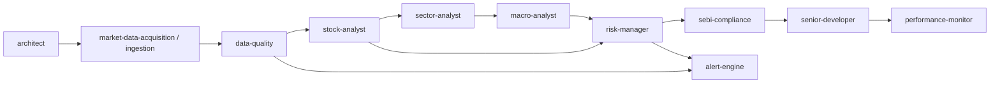

# Agent ecosystem review — technical analysis / trading application

## 1. Agents reviewed (`.cursor/agents`)

| File | Role summary |
|------|----------------|
| `architect.agent.md` | System design, phased roadmap, ADRs, NFRs, cloud evolution |
| `senior-developer.agent.md` | Implementation, reviews, patterns, security/perf |
| `custom-ai.agent.md` | Designing agents/skills, RAG/orchestration, token-efficient templates |
| `stock-analyst.agent.md` | TA/FA, patterns, indicators, options/futures, backtest concepts, entry/exit framing |
| `sebi-compliance.agent.md` | SEBI/NSE/BSE/RBI compliance, data governance, algo/logging themes |
| `data-quality.agent.md` | OHLCV validation, cross-source checks, pre-backtest data gate |
| `macro-analyst.agent.md` | Macro, RBI, FII/DII, geopolitical, sector macro map |
| `sector-analyst.agent.md` | Sector rotation, valuations, flows, regulatory at sector level |
| `risk-manager.agent.md` | VaR, leverage, concentration, margin, portfolio risk narrative |
| `performance-monitor.agent.md` | API/DB/queue SLOs, latency, capacity |

## 2. Coverage vs TA / trading product

| Agent | Fit | Gap |
|-------|-----|-----|
| architect | Decomposition, Azure/cloud path, ADRs | Market data plane, backtest batch topology, extension threat model |
| senior-developer | Build, reviews, NFRs | Not owner for market data or quant methodology |
| custom-ai | New agents, RAG, workflows | Domain specifics only if added to prompts |
| stock-analyst | Broad TA, volume, seasonality, derivatives, trade framing | Pine as platform, ingest pipelines, executable backtest spec depth |
| sebi-compliance | Source risk, logging, leverage/position themes | Ingest engineering |
| data-quality | OHLCV sanity, multi-source | Handoff to missing `alert-engine`; rules illustrative vs exchange-precise |
| macro-analyst | Geo/macro, flows, RBI | Handoff to missing `orchestrator` |
| sector-analyst | Rotation, flows, sector regulation | Handoff to missing `fundamental-analyst` |
| risk-manager | Risk metrics narrative | Handoff to missing `alert-engine`; numeric “limits” must align with sebi-compliance |
| performance-monitor | Online service SLOs | Batch backtest / Windows desktop profiling not first-class |

## 3. Dangling handoffs (target agent file missing)

| Source agent | Handoff target | Status |
|--------------|----------------|--------|
| `macro-analyst` | `orchestrator` | No `orchestrator.agent.md` in repo |
| `data-quality` | `alert-engine` | No `alert-engine.agent.md` in repo |
| `risk-manager` | `alert-engine` | No `alert-engine.agent.md` in repo |
| `sector-analyst` | `fundamental-analyst` | No `fundamental-analyst.agent.md` in repo |

**Resolution options:** add those agents, or retarget handoffs to existing agents (e.g. `stock-analyst`, `senior-developer`).

## 4. New sub-agents — priority

### P0

| Suggested id | Purpose |
|--------------|---------|
| `orchestrator` | Entry point: chain macro → sector → stock → risk → sebi → implementation |
| `alert-engine` | Alert schema, dedupe, severity, channels (Windows, email, extension) |
| `fundamental-analyst` | Bottom-up stock validation for sector workflows; *or* drop and hand off to `stock-analyst` |

### P1

| Suggested id | Purpose |
|--------------|---------|
| `market-data-acquisition` | Source matrix (API vs scrape), normalization, sessions/splits, rate limits |
| `pine-script-platform` | Pine vs local engine parity, indicator porting |
| `backtest-research` | Walk-forward, OOS, overfitting controls, reporting (optional split from `stock-analyst`) |

### P2

| Suggested id | Purpose |
|--------------|---------|
| `local-ai-mlops` | Local LLM, RAG, vector DB on Windows; *or* extend `custom-ai` |
| `client-platform` | Chrome extension ↔ local API, auth, threat model |

**Not recommended:** separate agents per indicator (RSI, MACD, Fibonacci, etc.) — `stock-analyst` already covers taxonomy.

## 5. Modifications to existing agents (intent)

| Agent | Change |
|-------|--------|
| macro-analyst | Fix `orchestrator` handoff (create orchestrator or point to `stock-analyst` + `risk-manager`) |
| sector-analyst | Fix `fundamental-analyst` handoff → `stock-analyst` or restore FA agent |
| data-quality | Fix `alert-engine` handoff (create agent or interim `senior-developer`); optional NSE session/holiday/adjustments |
| risk-manager | Fix `alert-engine` handoff; cross-ref `sebi-compliance` for limits |
| stock-analyst | Optional: multi-horizon subsection; Pine/TV integration pointer or handoff to `pine-script-platform` |
| architect | Optional: reference block ingest → features → backtest → signals → alerts → UI |
| senior-developer | Optional: .NET + Python sidecar for TA/backtest |
| performance-monitor | Optional: batch/backtest job metrics |
| custom-ai | Optional: example frontmatter for orchestrator / ingestion agent |

## 6. Minimal new-file set

1. Add `orchestrator` + `alert-engine`.
2. Change `sector-analyst` handoff from `fundamental-analyst` → `stock-analyst` (unless FA agent restored).

## 7. Multi-agent workflow (reference)

(Orchestrator can sit above as single entry: invoke subset per task.)

---

*Generated for review. No repo agent files were modified in the session that produced this document.*
